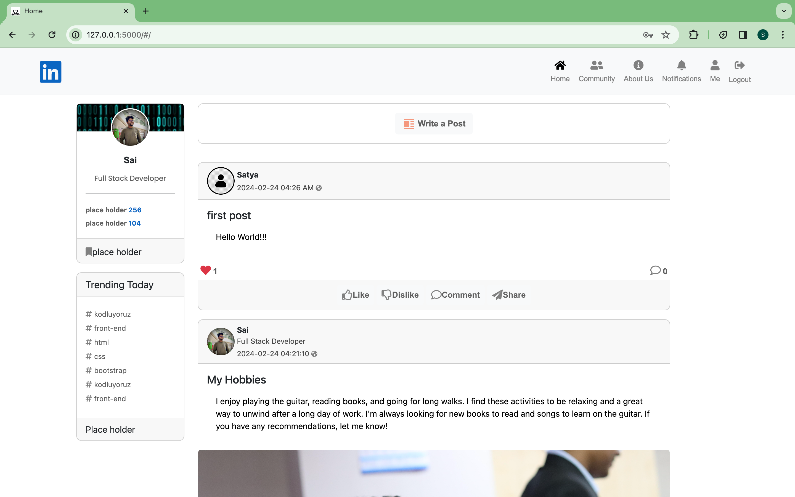
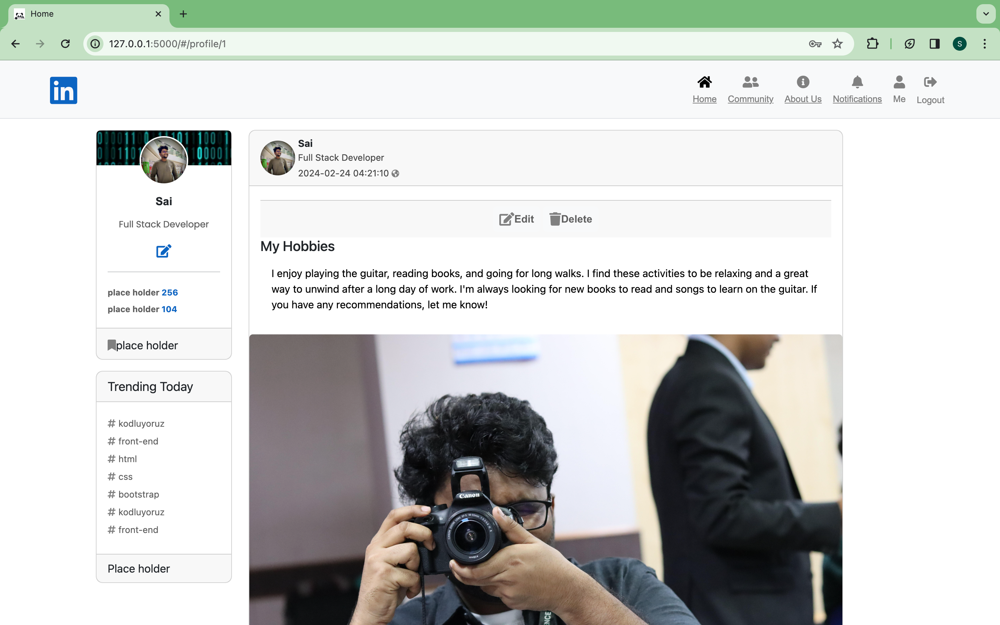

# Social Media web application dashboard (Linkedin Clone)

This project is a sophisticated multi-user Social Media web application dashboard (Linkedin Clone) that seamlessly integrates Vue.js for the frontend and Flask for the backend. Bootstrap ensures an intuitive, user-friendly interface, allowing for dynamic interactions and real-time updates. The application is designed to provide a comprehensive and seamless social media experience.

Browse to the [Social Media web application dashboard (Linkedin Clone)](http://satya-linkedin-clone.ap-south-1.elasticbeanstalk.com) to view the deployed application.

- [Social Media web application dashboard (Linkedin Clone)](#social-media-web-application-dashboard-linkedin-clone)
  - [Installation](#installation)
  - [Usage](#usage)
  - [Screenshots](#screenshots)
  - [Description](#description)
  - [Architecture and Features](#architecture-and-features)

## Installation

1. Create a virtual environment:
`python3 -m venv venv`

2. Activate the virtual environment:
`source venv/bin/activate`

3. Install required dependencies:
`pip install -r requirements.txt`

4. Set up Environment Variables:
`export DATABASE_URL=sqlite:///database.sqlite3`

5. Create a SQLite3 database by running:
`python3 upload_initial_data.py`

6. Start the Flask server:
`python3 app.py`

7. Visit `localhost:5000` in your browser to access the grocery store application.

## Usage
Register as a new user and login to access social media dashboard

## Screenshots

- **Home Page**:

- **My Profile Page**:

## Description

This application is designed to provide a comprehensive and seamless social media experience, offering a responsive and interactive user interface. The project is built using Vue.js for the frontend and Flask for the backend, ensuring a seamless integration of technologies. Bootstrap is used to create an intuitive and user-friendly interface, allowing for dynamic interactions and real-time updates.

- **Vue.js & Flask Integration**: Frontend and backend technologies merge seamlessly to offer a responsive and interactive user experience.

- **Dynamic Post Management**: Users can create, edit, and delete posts, ensuring a dynamic and engaging social media experience.

- **Security Features**: Token-based authentication ensures secure access for different user roles, while role-based access control ensures data integrity.

- **Flask REST APIs**: Strict data validation through APIs ensures accuracy and integrity of user interactions.

## Architecture and Features

The project's architecture consists of several key components:

- **Model Definitions**: `model.py` contains definitions for different models like User, Posts, Analytics, etc.

- **Controllers and API Endpoints**: `app.py` manages app creation and controllers, while `api.py` houses all API endpoints.

- **Token-based Authentication**: Implementation of token-based authentication for secure access to different user roles.

- **Role-based Access Control**: Creators can edit and delete their posts.

- **Websockets**: Real-time updates and dynamic interactions are enabled through websockets.

